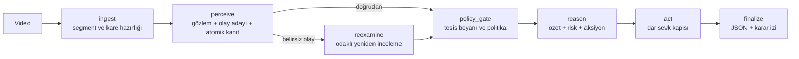

# DilAjanları — Kanıta Dayalı İSG Video Analiz Ajanı

**TEKNOFEST 2026 · Türkçe Yapay Zekâ Dil Ajanları Yarışması · 3. Senaryo**

DilAjanları, endüstriyel videolardan zaman damgalı İş Sağlığı ve Güvenliği
(İSG) olayları çıkaran, risk ve aksiyon üreten, sonuçlarını Türkçe ve
yapılandırılmış biçimde sunan çok modelli bir karar destek ajanıdır.

Bu proje bir VLM'e yalnızca “videoda ne oldu?” diye sorup serbest metin cevabını
doğru kabul etmez. Görsel iddialar küçük kanıt atomlarına ayrılır; gözlem,
fiziksel ilişki ve zaman bilgisi ayrı sorularla ölçülür; son hüküm ve operasyonel
sevk deterministik kapılardan geçer. Ana hedef, İSG kapsamını artırırken
halüsinasyonların gerçek bir alarm veya müdahale çağrısına dönüşmesini önlemektir.

> **Güncel sürüm profili — 28 Ağustos 2026:** Öğrenilmiş çıkarım yalnızca
> `https://evren-llmapi.ssyz.org.tr/v1` özel API'sinde ve sabit
> `vlm`, `llm-large`, `llm-fast` model takma adlarıyla yapılır. Model indirme ve
> yerel öğrenilmiş çıkarım varsayılan olarak kapalıdır. API anahtarı hiçbir zaman
> repoya yazılmaz.

## İçindekiler

- [Sistem ne üretir?](#sistem-ne-üretir)
- [Halüsinasyonları nasıl sınırlar?](#halüsinasyonları-nasıl-sınırlar)
- [Mimari ve üç modelin rolleri](#mimari-ve-üç-modelin-rolleri)
- [Hızlı kurulum](#hızlı-kurulum)
- [Kullanım](#kullanım)
- [Yapılandırma](#yapılandırma)
- [Benchmark sonuçları](#benchmark-sonuçları)
- [Test ve doğrulama](#test-ve-doğrulama)
- [Veri, lisans ve gizlilik](#veri-lisans-ve-gizlilik)
- [Bilinen sınırlar](#bilinen-sınırlar)
- [Sorun giderme](#sorun-giderme)
- [Proje yapısı](#proje-yapısı)

## Sistem ne üretir?

Bir video için sistem şunları üretir:

- zaman damgalı olay listesi;
- olay başına önem derecesi, kategori ve varsa görüntü bölgesi;
- Türkçe operasyon özeti;
- gerekçeli genel risk seviyesi;
- önceliklendirilmiş aksiyon önerileri;
- çağrılan operasyonel fonksiyonlar ve ayrıntılı çağrı günlüğü;
- düğüm düğüm karar izi;
- isteğe bağlı operatör sorusuna, yalnız analiz kanıtlarına dayalı yanıt;
- olay tutanağı, kanıt paketi ve vardiya brifingi.

Operasyonel fonksiyonlar bu depoda **simülasyon/mock** niteliğindedir. Gerçek bir
acil durdurma, sağlık ekibi veya saha otomasyonu entegrasyonu yapılmadan fiziksel
bir sistemi kontrol etmez.

## Halüsinasyonları nasıl sınırlar?

Ana çalışma yolu şu güvenlik ilkelerine dayanır:

1. **İddia ayrıştırma:** “Yangın var ve bir kişi yaralandı” gibi birleşik bir
   cümle tek doğru/yanlış kararı olarak kabul edilmez. Yangın, kişi, fiziksel
   sonuç ve zamansal ilişki ayrı kanıtlanır.
2. **Kapalı cevap uzayı:** Kanıt soruları serbest nesir yerine sınırlı seçeneklerle
   yanıtlanır. Belirsiz görüntüde sistemin kaçış/çekimser kalma seçeneği vardır.
3. **Rol ayrımı:** `vlm` görünür nesne ve belirtileri; `llm-large` ilişki, zaman ve
   olay mantığını; `llm-fast` yapılandırma ve kontrollü metin üretimini üstlenir.
4. **Deterministik birleştirme:** Gerekli kanıt atomlarının tamamı desteklenmeden
   kritik olay tutulmaz. Modelin kendinden emin yazması bu kapıyı aşmaz.
5. **İSG-odaklı anlatı filtresi:** Ailesiz “şüpheli hareket”, “nesne belirdi” veya
   sahne türünden türetilen genel anomali iddiaları tek başına alarm olamaz.
6. **Tesis beyanı kapısı:** KKD, yetki işareti, forklift yük eşiği ve sabit pano
   ROI'si evrensel gerçekler gibi yorumlanmaz. İhlal üretmek için ilgili tesis
   kuralı veya kalibrasyon açıkça beyan edilmelidir.
7. **Sevk ayrımı:** Bir olayın operatöre gösterilmesi ile operasyonel fonksiyon
   çağırması aynı karar değildir. Sevk daha dar bir kapıdan geçer.
8. **Hata görünürlüğü:** API hatası veya tamamlanmayan analiz “temiz video” diye
   sunulmaz; arayüz sonucu eksik olarak işaretler.

Özellikle duman konusunda, görünür plüm/bulanıklık tek başına “yangın” sayılmaz.
Akut yangın iddiası için görünür kaynak/alev, tutarlı zamansal gelişim veya başka
zorunlu atomların desteği gerekir. Duman sonrası insan hareketliliği yalnızca
ikincil bağlamdır; tek başına yangın üretmez.

Deneysel recall artırıcı fallback'ler kodda araştırma amacıyla bulunur ancak
bağımsız kabul kapılarını geçmedikleri için varsayılan olarak kapalıdır.

## Mimari ve üç modelin rolleri



LangGraph akışı yedi düğümlüdür. `reexamine` yalnız koşul oluştuğunda çalışır;
diğer durumda akış doğrudan `policy_gate` düğümüne geçer. Her düğüm hata
yakalayıcıları ve karar iziyle çevrilidir.

| Model | Ana görev | Karar sınırı |
|---|---|---|
| `vlm` | Videodan nötr görsel gözlem; kişi, nesne, görünür belirti ve nitelik | Serbest nesri doğrudan alarm değildir |
| `llm-large` | Açık dünya olay taraması; fiziksel ilişki, zaman, çarpışma/düşme gibi olay mantığı | Kanıt kapıları ve kural motoru tarafından doğrulanır |
| `llm-fast` | JSON yapılandırma, kontrollü özet, yönlendirme ve operasyon argümanları | Yeni görsel olgu ekleyemez |

Üç model **aynı sistemin farklı aşamalarında birlikte** kullanılır. Her video için
üçüne de koşulsuz aynı soru gönderilmez; gerekli aşama ve kanıt ailesine göre çağrı
yapılır. Bu, “üç ayrı benchmark modeli” değil, tek bir üç-modelli boru hattıdır.

İstek ayarları analiz süresince yalıtılır. Bir videonun tesis kuralı, sohbet
bağlamı, olayları veya yükleme durumu ikinci videoya taşınmaz. Yeni video
yüklendiğinde video-kapsamlı durum tamamen sıfırlanır.

## Hızlı kurulum

### Ön koşullar

- Linux veya WSL2 üzerinde Ubuntu 24.04 önerilir;
- Python 3.12;
- `ffmpeg`;
- özel API için geçerli takım anahtarı.

Güncel özel-API profilinde yerel GPU gerekmez ve çalışma zamanında model ağırlığı
indirilmez. `requirements-api.txt` yalnız istemci, ajan, video işleme ve arayüz
paketlerini kurar; vLLM, Torch, Transformers veya YOLO içermez.

```bash
git clone https://github.com/ahmedberatAI/Dil-Ajanlari-Teknofest.git
cd Dil-Ajanlari-Teknofest

sudo apt update
sudo apt install -y python3-venv python3-pip ffmpeg

python3 -m venv .venv
source .venv/bin/activate
python -m pip install --upgrade pip
python -m pip install -r requirements-api.txt

cp .env.ornek .env
```

Tarihsel yerel geliştirme, eski model-servisleme araçları veya bütün deney
bağımlılıkları gerçekten gerekiyorsa WSL/Linux üzerinde ayrıca
`python -m pip install -r requirements.txt` kullanılabilir. Güncel özel-API
uygulamasını ve InspecSafe koşucularını çalıştırmak için buna gerek yoktur.

Ardından `.env` içindeki yalnızca örnek anahtarı gerçek takım anahtarıyla
değiştirin:

```dotenv
DILAJAN_API_BASE_URL=https://evren-llmapi.ssyz.org.tr/v1
DILAJAN_API_KEY=sk-evren-teamNN-XXXXXXXX
```

`.env` Git tarafından yok sayılır. Anahtarı terminal çıktısına, ekran görüntüsüne,
commit'e veya benchmark raporuna koymayın.

### Profil ve bağlantı kontrolü

Bu komutlar anahtarı yazdırmadan etkin sözleşmeyi ve API erişimini doğrular:

```bash
python -c "from dilajan.config import settings; print(settings.base_url, settings.gorev_modeli('algi'), settings.gorev_modeli('olay'), settings.gorev_modeli('yapi'))"
python -c "from dilajan.llm_client import VLMClient; assert VLMClient().health_check(), 'Özel API erişilemiyor'; print('Özel API hazır')"
```

Beklenen ilk çıktı:

```text
https://evren-llmapi.ssyz.org.tr/v1 vlm llm-large llm-fast
```

> Üretim/yarışma profilinde `serve_vllm.py` çalıştırmayın ve `.env.yerel`
> kullanmayın. Bunlar tarihsel yerel geliştirme yoludur; güncel sürümün model
> sözleşmesi değildir.

## Kullanım

### Web arayüzü

```bash
python app.py
```

Ardından [http://127.0.0.1:7860](http://127.0.0.1:7860) adresini açın.

Önerilen kullanım sırası:

1. Videoyu yükleyin.
2. Varsa tesise özgü kuralları ve gerçekten kalibre edilmiş seçenekleri girin.
3. İsterseniz “analiz sorgusu” ile forklift, duman veya belirli bir bölgeye odak
   verin. Sorgu kritik başka olayları filtrelemez.
4. **ANALİZİ BAŞLAT** düğmesine basın ve akışın tamamlanmasını bekleyin.
5. Özet, risk, İSG ölçümleri, olay tablosu, aksiyonlar, çağrılar ve karar izini
   birlikte değerlendirin.

Yeni bir video seçildiğinde önceki videonun özeti, sohbeti, olayları, JSON'u,
raporu ve istek ayarları temizlenir. İkinci analiz birinciden bağımsızdır.

`DILAJAN_HOST=0.0.0.0` aynı ağdan erişimi, `DILAJAN_SHARE=1` geçici Gradio
paylaşımını açar. Paylaşım açıldığında videoların ve tesis bilgilerinin erişim
kapsamını ayrıca değerlendirin.

### Komut satırı

```bash
python run_analysis.py data/ornek.mp4
python run_analysis.py data/ornek.mp4 --sartname --json outputs/sonuc.json
python run_analysis.py data/ornek.mp4 --query "Dumanın kaynağı ve zamansal gelişimi nedir?"
```

`--sartname` çıktısı tam olarak `summary`, `events`, `risk`, `actions` olmak üzere
dört anahtar içerir. Bayrak kullanılmazsa karar izi, çağrı günlüğü, bölge ve
operatör sorgusu yanıtı gibi zengin alanlar da döner.

### Örnek çıktı

Aşağıdaki yalnızca şema örneğidir:

```json
{
  "summary": "Doğrulanmış yüksek riskli bir İSG olayı bulunmadı.",
  "events": [],
  "risk": {
    "level": "Düşük",
    "rationale": "Analiz edilen kanıtlarda sevk gerektiren bir olay doğrulanmadı."
  },
  "actions": [],
  "video_duration": "00:18",
  "triggered_functions": [],
  "action_log": [],
  "decision_trace": [
    "ingest: video segmentlere ayrıldı",
    "perceive: atomik kanıt kapısı uygulandı",
    "act: operasyonel çağrı yapılmadı"
  ]
}
```

## Yapılandırma

Kanonik örnek dosya [`.env.ornek`](.env.ornek), merkezi tanımlar ise
[`dilajan/config.py`](dilajan/config.py) içindedir.

| Ayar | Güncel değer / anlam |
|---|---|
| `DILAJAN_API_BASE_URL` | Sabit özel API; boş bırakmak yerel modele sessiz düşüş oluşturmaz |
| `DILAJAN_API_KEY` | Zorunlu gizli takım anahtarı |
| `DILAJAN_API_TIMEOUT` | Uzun video çağrıları için `1800` saniye |
| `DILAJAN_MODEL_ALGI` | `vlm` |
| `DILAJAN_MODEL_OLAY` | `llm-large` |
| `DILAJAN_MODEL_YAPI`, `DILAJAN_MODEL_OZET` | `llm-fast` |
| `DILAJAN_ATOMIC_CLAIM_GUARD` | `1`; kritik iddiaları atomik kanıta bağlar |
| `DILAJAN_NARRATIVE_EVENT_POLICY` | `isg_grounded`; ailesiz anlatı alarmını keser |
| `DILAJAN_YEREL_OGRENILMIS_IZNI` | `0`; YOLO/RT-DETR/pose gibi yerel öğrenilmiş yollar kapalı |
| `DILAJAN_MODEL_INDIRME_IZNI` | `0`; çalışma zamanında ağırlık indirilmez |

`CLOSED_FAMILY_FALLBACK`, `STRUCTURED_FIRE_DUST_VETO`, `THERMAL_FALLBACK`,
`PHYSICAL_EXPERT_FALLBACK`, `INDUSTRIAL_INCIDENT_FALLBACK`,
`NARROW_INDUSTRIAL_RETRY` ve `CONTINUOUS_FALL_FALLBACK` deneysel araştırma
kollarıdır. Geliştirme ve bağımsız holdout kapıları geçmeden üretimde açılmamalıdır.

Arayüzdeki tesis kuralları istek-kapsamlıdır. Örneğin “yelek yoksa yetkisiz” veya
“üç kasa üzeri aşırı yük” ancak gerçekten o tesiste doğrulanmış bir politika ise
etkinleştirilmelidir. Bu kutuları gelişigüzel açmak model başarısını artırmaz;
tesise özgü yanlış pozitif üretir.

## Benchmark sonuçları

Sonuçları tek bir yüzdeye indirgemiyoruz. Precision, recall, normal yanlış pozitif,
kapsama ve karar kapısı birlikte okunmalıdır.

### 1. InspecSafe-V1 resmî test — 1.250 örnek

Sabit üç model ve özel API ile tamamlanan gerçek test koşusu:

| Kol | 4-sınıf strict accuracy | Unsafe precision | Unsafe recall | Normal FPR | Kapsama |
|---|---:|---:|---:|---:|---:|
| Doğrudan `vlm` | 781/1250 = **%62,5** | %41,6 | %92,0 | %32,4 | %96,9 |
| Tam üç-modelli sistem | 1044/1250 = **%83,5** | **%70,6** | %61,4 | **%6,4** | **%99,8** |

Üç-modelli sistem direct kolun 312 hatasını düzeltti, 49 doğrusunu bozdu;
accuracy farkı `+21,0` puan ve eşleşik McNemar `p=5,67e-48` oldu. Ön-kayıtlı
kapı accuracy, precision, FPR ve kapsamda geçti; **recall direct kola göre düştüğü
için genel gerilemesizlik kapısı kaldı**. Bu sonuç saklanır, gizlenmez.

Tam rapor:
[`docs/benchmark_inspecsafe_v1_6affe2e2f1d92cd8_2026-08-28.md`](docs/benchmark_inspecsafe_v1_6affe2e2f1d92cd8_2026-08-28.md)

### 2. InspecSafe-V1 hiyerarşik calibration — 734 örnek

Resmî testten sonra geliştirilen yüksek-performans profili
`hybrid / rescue=0.70 / veto=0.21` olarak kilitlendi:

| Metrik | Sonuç |
|---|---:|
| 4-sınıf empirical accuracy | 554/734 = **%75,5** |
| Unsafe recall | 288/367 = **%78,5** |
| Normal FPR | 11/367 = **%3,0** |
| Test-öncüllü unsafe precision | **%86,8** |
| Test-öncüllü unsafe F1 | **%82,4** |
| Kapsama | 734/734 = **%100** |

Bu profil calibration kapısını geçmiştir ancak durumu
`calibration_locked_pending_development_and_holdout` olarak kayıtlıdır. Yani
**nihai saha veya bağımsız holdout skoru değildir**. Calibration üzerindeki
gözlenen precision `288/(288+11) = %96,3` olsa da sınıf öncülü test dağılımına
uyarlandığında raporlanan değer `%86,8`'dir.

Kaynaklar:

- [birincil makine-okunur kayıt](benchmark/results/inspecsafe_hier_primary_receipt_1561cd7592a2e498.json)
- [katı gerilemesizlik kilidi](benchmark/results/inspecsafe_hier_lock_1561cd7592a2e498.json)
- [insan-okunur calibration raporu](docs/rapor_inspecsafe_hier_calibration_999a6975370227ee_2026-08-28.md)

### 3. Dengeli genel İSG video non-regression — 200 örnek

Güncel aday kolun dengeli 100 unsafe + 100 normal arşivindeki sonucu:

| Metrik | Güncel aday | Önceki referans |
|---|---:|---:|
| Precision | 70/75 = **%93,3** | 77/83 = %92,8 |
| Recall | 70/100 = **%70,0** | 77/100 = %77,0 |
| Operasyonel FP | 5/100 = **%5,0** | 6/100 = %6,0 |
| Dispatch FP | 3/100 = **%3,0** | 5/100 = %5,0 |

Bu aday precision ve iki FP ölçüsünü iyileştirdi; recall `%77`den `%70`e düştüğü
için katı non-regression sonucu **FAIL** oldu. Dolayısıyla güncel sürümün
“halüsinasyon kontrolü iyileşti” yönünde kanıtı vardır, fakat “precision ve recall
birlikte gerilemedi” iddiası yoktur.

- **Operasyonel FP:** güvenli videoda herhangi bir olay üretilmesi veya fonksiyon
  çağrısı kaydı oluşmasıdır.
- **Dispatch FP:** güvenli videoda operasyonel fonksiyonun gerçekten tetiklenmesidir.
- **Precision ile aynı şey değildir:** precision, üretilen pozitiflerin ne kadarının
  doğru olduğunu; FP oranları güvenli örneklerin ne kadarının yanlış ateşlediğini ölçer.

Makine-okunur kayıt:
[`benchmark/results/nonreg_v15_vs_v13n_20260828.json`](benchmark/results/nonreg_v15_vs_v13n_20260828.json)

### Benchmarkı yeniden çalıştırma

Veri ve manifest yerindeyse önce yalnız doğrulama yapın:

```bash
python benchmark/inspecsafe_v1.py --validate-only
python benchmark/inspecsafe_v1_hierarchical.py --phase calibration --validate-only
```

Gerçek API koşusu maliyetli ve uzun sürelidir:

```bash
python benchmark/inspecsafe_v1.py --workers 4
python benchmark/inspecsafe_v1_hierarchical.py --phase development --workers 4
```

Eski ve aday iki arşivi model çağırmadan karşılaştırmak için:

```bash
python benchmark/isg_nonregression_gate.py eski.json aday.json \
  --report-json benchmark/results/nonreg_kayit.json
```

Benchmark koşucuları özel API ve sabit model sözleşmesini fail-closed doğrular;
yerel veya farklı modelle koşuyu kabul etmez. Etiket, dosya adı ve anotasyon model
mesajına verilmez.

## Test ve doğrulama

Tek komutla proje bütünlüğü, lisans kapısı ve bağımsız test betikleri:

```bash
python scripts/hazirlik_kontrol.py
```

Hızlı ve odaklı denetimler:

```bash
python tests/test_model_routing.py
python tests/test_isg_claim_guard.py
python tests/test_video_upload_isolation.py
python tests/test_sablon_kalip.py
```

28 Ağustos 2026 sürüm kontrolünde:

- `78/78` pytest testi geçti;
- `47/47` tarihsel bağımsız denetim betiği geçti;
- Python kaynakları bytecode derlemesinden geçti;
- sürüm JSON'ları ayrıştırıldı;
- commit kapsamına gerçek API anahtarı girmedi.

`tests/` altında pytest testleri ile doğrudan çalıştırılan tarihsel betikler birlikte
bulunur. Bazı tarihsel dosyalar modül sonunda `sys.exit` kullandığı için bütün dizini
tek seferde `pytest tests/` olarak toplamak doğru değildir; kanonik giriş
`scripts/hazirlik_kontrol.py` dosyasıdır.

## Veri, lisans ve gizlilik

Ham videolar Git'e alınmaz; `data/` yok sayılır. Kaynaklar, lisanslar, manifestler
ve indirme bağlantıları şurada belgelenir:

- [veri kaynakları ve kullanım sınırları](docs/veri_kaynaklari.md)
- [doğrudan indirme bağlantıları](docs/veri_indirme_linkleri.md)
- [InspecSafe-V1 test manifesti](benchmark/results/inspecsafe_v1_manifest_13721d4b691312a2.json)
- [InspecSafe-V1 train manifesti](benchmark/results/inspecsafe_train_manifest_1561cd7592a2e498.json)

Değerlendirme-only veri eğitimde kullanılmaz. `dilajan/veri_lisans.py` yasaklı
bir veri kökü eğitime girerse işlemi fail-closed durdurur. Gerçek tesis görüntüleri
çalışan yüzleri, kıyafetleri ve kurum işaretlerini içerebilir; kaynak lisansının
yeniden dağıtıma izin vermesi KVKK/gizlilik yükümlülüğünü ortadan kaldırmaz.

Manifest SHA-256 değerleri veri sürümünü, runner/prompt hash'leri ise ölçüm
protokolünü sabitler. Farklı manifestle çıkan skor aynı koşunun devamı sayılmaz.

## Bilinen sınırlar

- Sistem bir İSG uzmanının, saha prosedürünün veya sertifikalı yangın algılama
  sisteminin yerine geçmez.
- “Tüm İSG senaryolarında maksimum performans” henüz kanıtlanmış değildir. Veri
  alanı, kamera açısı, gece/termal görüntü ve nadir olaylar arasında dağılım farkı
  vardır.
- Güncel genel video adayında recall `%70`tir; gerçek olay kaçırma riski sürer.
- Hiyerarşik `%78,5` recall calibration sonucudur; development ve holdout onayı
  beklemektedir.
- InspecSafe Level III calibration desteği yalnız altı örnektir ve recall `0/6`dır;
  ince risk seviyesi sınıflandırması hâlâ darboğazdır.
- Görünür duman/plüm tek başına yangın değildir. Aşırı sert veto gerçek yangını
  kaçırabileceği için başarısız deneysel veto üretime alınmamıştır.
- Özel API erişilemezse öğrenilmiş analiz tamamlanamaz. Sistem yerel modele sessizce
  düşmez; eksik sonucu hata olarak gösterir.
- Yerel YOLO/RT-DETR/pose/KKD modelleri güncel özel-API profilinde çalışmaz.
  Ağırlık indirilmez; KKD ve düşme doğrulama yolları atlandığında neden karar
  izine yazılır.
- Gerçek operasyon entegrasyonları mock'tur; saha sistemine bağlanmadan önce kimlik
  doğrulama, yetkilendirme, insan onayı ve geri alma tasarımı gerekir.

## Sorun giderme

| Belirti | Kontrol / çözüm |
|---|---|
| “Özel API erişilemiyor” | `.env` anahtarını, sabit base URL'yi, ağı ve takım anahtarının geçerliliğini kontrol edin; health-check komutunu çalıştırın |
| Analiz bitmiyor veya uzun sürüyor | `DILAJAN_API_TIMEOUT=1800` değerini koruyun; aynı videoyu art arda tekrar kuyruğa eklemeyin; servis durumunu kontrol edin |
| Kuyruk `1/1` görünüyor | Bir analiz etkin demektir; istek-kapsamlı tesis ayarları birbirine sızmasın diye kritik bölüm seri çalışabilir |
| Video tarayıcıda oynatılmıyor | `ffmpeg` kurulumunu doğrulayın; arayüz desteklenmeyen codec'i H.264/yuv420p biçimine dönüştürür |
| İkinci videoda eski sonuç görünüyor | Güncel sürümde yükleme önce tüm video durumunu sıfırlar; tarayıcıyı yenileyip tekrar yükleyin ve `tests/test_video_upload_isolation.py` testini çalıştırın |
| KKD/YOLO seçeneği sonuç üretmiyor | Özel-API sürümünde yerel öğrenilmiş modeller bilerek yasaktır; KKD/düşme için karar izindeki açıklamayı okuyun |
| “Olay yok” ile “analiz başarısız” karışıyor | Arayüzün üst hata bandını ve `decision_trace` alanını kontrol edin; API hatalı sonuç tamamlanmış sayılmaz |
| Yanlış duman/yangın iddiası | Zaman damgası ve atomik kanıt izini inceleyin; yalnız plüm gözlemi sevk üretmemelidir |
| API anahtarı yanlışlıkla paylaşıldı | Anahtarı derhâl iptal/rotate edin; Git geçmişinden silmek tek başına yeterli değildir |

## Proje yapısı

```text
app.py                         Gradio arayüzü ve video-kapsamlı durum izolasyonu
run_analysis.py                Video -> yapılandırılmış JSON komut satırı girişi
requirements-api.txt           Model indirmeyen özel-API çalışma bağımlılıkları
dilajan/
  agent/graph.py               Yedi düğümlü LangGraph karar akışı
  config.py                    Özel API, sabit model ve güvenlik varsayılanları
  llm_client.py                OpenAI-uyumlu özel API istemcisi ve video oturumu
  isg_kanit.py                 Atomik İSG iddia/kanıt ayrıştırması
  duman_kanit.py               Duman, plüm ve yangın kanıt yardımcıları
  dusme_kanit_v2.py            Düşme/yaralı kişi fiziksel-zamansal kanıtı
  kkd_beyan.py                 KKD için tesis beyanı kapısı
  isg_kural.py                 Deterministik slot ve tesis kural motoru
  schema.py                    AnalysisResult/Event/Action veri sözleşmesi
benchmark/
  inspecsafe_v1.py             Resmî test koşucusu
  inspecsafe_v1_hierarchical.py Calibration/development/holdout karar yolu
  isg_nonregression_gate.py    Eşleşik precision/recall/FP gerileme kapısı
  results/                     Manifest, kilit ve makine-okunur sonuç kayıtları
scripts/
  hazirlik_kontrol.py          Kanonik bütünlük ve test girişi
  download_inspecsafe_train.ps1 InspecSafe train indirme/doğrulama aracı
tests/                         Pytest + tarihsel bağımsız regresyon denetimleri
docs/                          Mimari, veri, ön-kayıt ve deney raporları
```

## Belge önceliği

Depoda çok sayıda ön-kayıt ve tarihsel deney raporu vardır. Bunlar denetim izi
olarak korunur; güncel üretim ayarı oldukları anlamına gelmez. Çelişki halinde şu
sıra kullanılmalıdır:

1. bu `README` ve [güncel main sürüm kaydı](docs/main_release_2026-08-28.md);
2. makine-okunur manifest/kilit/receipt JSON'ları;
3. güncel kaynak kodu ve testler;
4. tarihsel `on_kayit_*` ve `rapor_*` deney belgeleri.

İSG VLM mimarileri için araştırma özeti:
[`docs/arastirma_isg_vlm_mimarileri_2026-08-27.md`](docs/arastirma_isg_vlm_mimarileri_2026-08-27.md)

## Lisans

Kaynak kod [Apache License 2.0](LICENSE) ile lisanslanır. Veri setleri ve isteğe
bağlı üçüncü taraf bileşenler kendi lisanslarına tabidir; Apache-2.0 proje lisansı
bu varlıkların lisansını değiştirmez.
