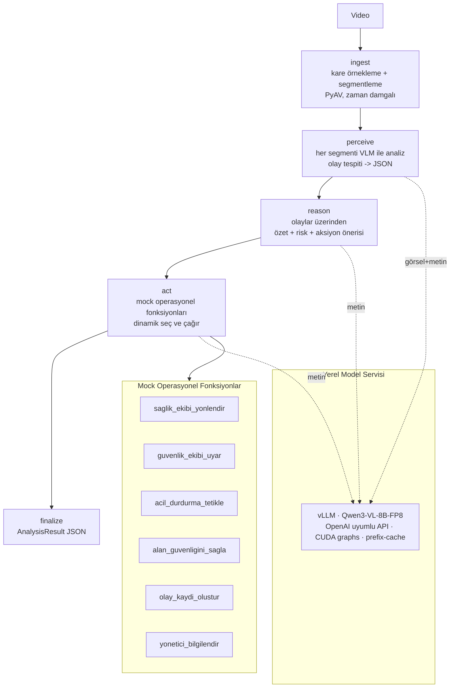

# Sistem Mimarisi

## Genel Bakış

DilAjanları, bir videoyu girdi alıp **tamamen yerel/offline** çalışan, multimodal
(video + metin) bir **yapay zekâ ajanı** ile analiz eder ve yapılandırılmış karar
destek çıktısı (zaman damgalı olaylar, Türkçe özet, risk değerlendirmesi, operatöre
aksiyon önerileri ve tetiklenen operasyonel fonksiyonlar) üretir.

## Akış Diyagramı



ASCII özeti:

```
Video → [ingest] → [perceive] → [reason] → [act] → [finalize] → JSON
                       │            │          │
                       └────────────┴──────────┴──→ vLLM (Qwen3-VL-8B-FP8)
                                               │
                                               └──→ Mock operasyonel fonksiyonlar
```

## Bileşenler

| Katman | Dosya | Görev |
|--------|-------|-------|
| Yapılandırma | `dilajan/config.py` | Merkezi ayarlar + CUDA ortam hazırlığı |
| Model istemcisi | `dilajan/llm_client.py` | vLLM'e multimodal (görsel+metin) OpenAI istemcisi |
| Video işleme | `dilajan/video.py` | PyAV ile zaman damgalı kare çıkarma + segmentleme |
| Şema | `dilajan/schema.py` | Pydantic çıktı sözleşmesi (`to_sartname_dict()`) |
| Promptlar | `dilajan/prompts.py` | Türkçe prompt şablonları (prompt engineering) |
| Mock araçlar | `dilajan/mock_functions.py` | Operasyonel fonksiyonlar (LangChain `@tool`) |
| Ajan | `dilajan/agent/graph.py` | LangGraph durum makinesi (5 düğüm) |
| Sunucu | `serve_vllm.py` | vLLM OpenAI sunucu başlatıcı |
| CLI | `run_analysis.py` | Video → JSON |
| Arayüz | `app.py` | Gradio: analiz + sohbet |
| Değerlendirme | `benchmark/evaluate.py` | KPI metrikleri |

## Tasarım Kararları

- **Statik değil, model-tabanlı:** Olay tespiti, risk ve aksiyon seçimi sabit
  if/else kurallarıyla değil, modelin akıl yürütmesiyle yapılır (şartname gereği).
- **Segmentleme:** Uzun videolar zaman pencerelerine bölünür; her segmentte azami
  kare sayısı sınırlanarak token kullanımı ve ölçeklenebilirlik kontrol edilir.
- **Hata toleransı:** Her LangGraph düğümü try/except ile sarılıdır; bir segment veya
  adım hata verirse akış çökmeden devam eder (`trace` ile izlenir).
- **Mock fonksiyonlar = ajanın araçları:** `act` düğümü, tespit edilen olaylara göre
  uygun operasyonel fonksiyonları **dinamik** seçip çağırır (model-tabanlı dispatch).
- **Yapılandırılmış + açıklanabilir çıktı:** JSON zorunlu; olay/zaman/önem/risk/aksiyon
  ayrıştırılmış ve gerekçelidir.

## Performans (RTX 5090 Laptop, 24GB, WSL2)

- Model servisleme: vLLM + CUDA graphs + prefix-caching (gpu-util 0.90, max-num-seqs 32).
- Uçtan uca analiz: ~1.5 s / video-saniyesi (hızlı mod ~0.6); eşzamanlı (x4) throughput +24% (3.7→4.6 video/dk).
- Tamamen yerel; dış API / bulut bağımlılığı yok.

### İki Aşamalı Algı (perceive)
Katı JSON olay-promptu düşük çözünürlüklü gerçek CCTV'de modeli aşırı temkinli yapıp
olayları kaçırıyordu. Çözüm: her segment **önce serbest Türkçe tarif** ettirilir (modelin
tam algısı ortaya çıkar), **sonra bu tariften olaylar JSON'a çıkarılır**. Bu yaklaşım gerçek
UCF-Crime kliplerinde tespit oranını belirgin artırır (recall öncelikli).

> KPI tanımları ve güncel ölçüm sonuçları için `benchmark/` ve README'ye bakınız.
