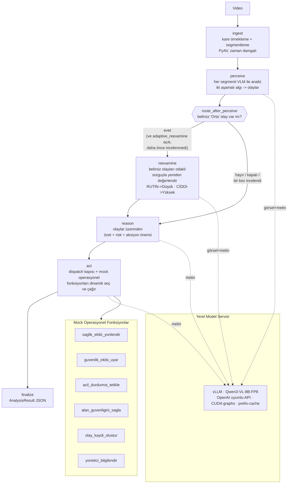

# Sistem Mimarisi

## Genel Bakış

DilAjanları, bir videoyu girdi alıp **yerel veya uzak çıkarım servisiyle** çalışabilen, multimodal
(video + metin) bir **yapay zekâ ajanı** ile analiz eder ve yapılandırılmış karar
destek çıktısı (zaman damgalı olaylar, Türkçe özet, risk değerlendirmesi, operatöre
aksiyon önerileri ve tetiklenen operasyonel fonksiyonlar) üretir.

Graf **6 düğümdür** ve `perceive` sonrasında **koşullu bir kenar** içerir: belirsiz
(Orta severity) olay varsa ajan `reexamine` düğümüne sapıp kendi tespitini yeniden sorgular,
yoksa doğrudan `reason`'a geçer. Bu, sabit bir boru hattı değil **adaptif** bir akıştır.

## Akış Diyagramı



ASCII özeti (gerçek graf, koşullu kenar dâhil):

```
                             ┌──────────────┐
                             │  reexamine   │   (koşullu düğüm — belirsiz "Orta" olay varsa)
                             └──▲────────┬──┘
              belirsiz olay var │        │
                                │        ▼
Video → [ingest] → [perceive] ──┴──────→ [reason] → [act] → [finalize] → JSON
                                  belirsiz olay yok /
                                  adaptive_reexamine kapalı /
                                  bir kez incelendi (döngü muhafızı)
   │            │           │        │        │
   │            └───────────┴────────┴────────┴──→ vLLM (Qwen3-VL-8B-FP8)
   │                                          │
   └── PyAV decode-once                       └──→ Mock operasyonel fonksiyonlar
                                                   (dispatch kapısı ile)
```

Yönlendirme kuralı `dilajan/agent/graph.py:route_after_perceive`'dedir; döngü muhafızı
`state["reexamined"]` sayesinde `reexamine` bir analizde en fazla **bir kez** çalışır
(sonsuz döngü imkânsız).

## Bileşenler

| Katman | Dosya | Görev |
|--------|-------|-------|
| Yapılandırma | `dilajan/config.py` | Merkezi ayarlar + CUDA ortam hazırlığı |
| Model istemcisi | `dilajan/llm_client.py` | vLLM'e multimodal (görsel+metin) OpenAI istemcisi |
| Video işleme | `dilajan/video.py` | PyAV ile zaman damgalı kare çıkarma + segmentleme |
| Şema | `dilajan/schema.py` | Pydantic çıktı sözleşmesi (`to_sartname_dict()`) |
| Promptlar | `dilajan/prompts.py` | Türkçe prompt şablonları (prompt engineering) |
| Mock araçlar | `dilajan/mock_functions.py` | Operasyonel fonksiyonlar (LangChain `@tool`) |
| Ajan | `dilajan/agent/graph.py` | LangGraph durum makinesi (**6 düğüm + 1 koşullu kenar**) |
| Sunucu | `serve_vllm.py` | vLLM OpenAI sunucu başlatıcı |
| CLI | `run_analysis.py` | Video → JSON |
| Arayüz | `app.py` | Gradio: analiz + sohbet |
| Değerlendirme | `benchmark/eval_clips.py`, `judge*.py` | KPI metrikleri |
| Raporlama hijyeni | `benchmark/stats_utils.py` | Wilson %95 GA + ondalık disiplini + pseudo-replikasyon uyarısı |

## Tasarım Kararları

- **Statik değil, model-tabanlı:** Olay tespiti, risk ve aksiyon seçimi sabit
  if/else kurallarıyla değil, modelin akıl yürütmesiyle yapılır (şartname gereği).
- **Adaptif akış:** `perceive` sonrası koşullu kenar, belirsizlik varken ek bir algı turu
  başlatır. Karar sabit bir boru hattının değil, ajanın kendi güven durumunun sonucudur.
- **Segmentleme:** Uzun videolar zaman pencerelerine bölünür; her segmentte azami
  kare sayısı sınırlanarak token kullanımı ve ölçeklenebilirlik kontrol edilir.
- **Hata toleransı (iki katman):**
  1. **Düğüm seviyesi** — altı düğümün (`ingest`, `perceive`, `reexamine`, `reason`, `act`,
     `finalize`) dış gövdesi try/except ile sarılıdır; bir düğüm hata verirse akış çökmez,
     karar-izine (`trace`) not düşülüp güvenli varsayılanla devam edilir. `finalize` hata
     alsa bile çıktı sözleşmesini bozmayan minimum bir `AnalysisResult` döndürür.
  2. **Segment içi fail-open** — bir segmentin analizi, grounding, doğrulama veya JSON
     ayrıştırması başarısız olursa o segment atlanır; diğer segmentler etkilenmez.
- **Eşzamanlılık güvenliği:** `act()` operasyonel çağrı kayıtlarını modül-globali yerine
  çağrıya özel yerel listede toplar; böylece grafı paralel koşturan çok-örnekli analizde
  koşuların kayıtları karışmaz.
- **Araç çağrısı onarımı:** Model yanlış argüman adı üretirse `_invoke_tool` argümanları
  olay bağlamından onarıp **tek kez** yeniden dener; kalıcı başarısızlıkta sessizce düşmez,
  karar-izine net bir UYARI yazar.
- **Mock fonksiyonlar = ajanın araçları:** `act` düğümü, tespit edilen olaylara göre
  uygun operasyonel fonksiyonları **dinamik** seçip çağırır (model-tabanlı dispatch),
  ancak yalnızca gerçek yüksek-risk sinyalinde (dispatch kapısı → alarm yorgunluğu kesilir).
- **Yapılandırılmış + açıklanabilir çıktı:** JSON zorunlu; olay/zaman/önem/risk/aksiyon
  ayrıştırılmış ve gerekçelidir; `decision_trace` ile karar izi görünür.

## Performans (RTX 5090 Laptop, 24 GB, WSL2)

Kayıtlı ölçüm: `benchmark/results/bench_perf_{baseline,prefixcache}_20260625.log` (n=6 klip).

| Metrik | Değer |
|---|---|
| Tek-akış gecikme | **0.86 s / video-saniyesi** ortalama (klip başına 0.44–3.75 aralığı) |
| Eş-zamanlı (×4) throughput | **4.2 video/dk** — prefix-caching ile 3.7'den **+13.5%** |
| Eş-zamanlı (×4) gecikme | 14.3 s/video (sıralı 27.9'dan) — hızlanma **1.95×** |
| Tepe VRAM | ~21 GB / 24 GB (FP8 ağırlık ~19 GB) |
| Servisleme | vLLM + CUDA graphs + prefix-caching, yalnızca `127.0.0.1` |

> Daha önce belgelerde geçen "+24% (3.7→4.6 video/dk)" iddiası **geri çekilmiştir**: kayıtlı log
> artefaktı yoktur. Gerekçe ve kanonik değerler → [`docs/olcum_durustlugu.md`](olcum_durustlugu.md) §5.

### İki Aşamalı Algı (perceive)
Katı JSON olay-promptu düşük çözünürlüklü gerçek CCTV'de modeli aşırı temkinli yapıp
olayları kaçırıyordu. Çözüm: her segment **önce serbest Türkçe tarif** ettirilir (modelin
tam algısı ortaya çıkar), **sonra bu tariften olaylar JSON'a çıkarılır**. Bu yaklaşım gerçek
UCF-Crime kliplerinde tespit oranını belirgin artırır (recall öncelikli).

> KPI tanımları, kanonik sayılar ve ölçüm sınırlarımız → [`docs/olcum_durustlugu.md`](olcum_durustlugu.md).
> Ham çıktı artefaktları → `benchmark/results/`.
